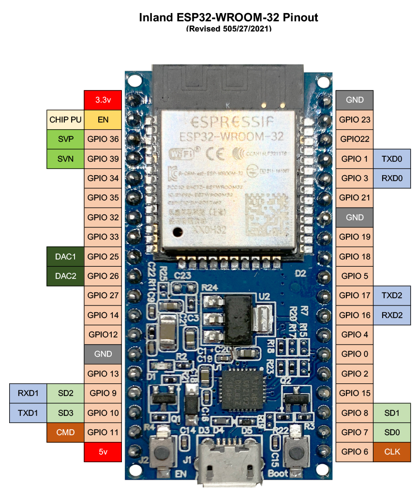

# Moshi moshi

Moshi Moshi is an open source version of [Dasai Mochi](https://dasai.com.au/products/mochi). Moshi randomly picks an
animation and runs that animation to include transitioning from the standby, or smile, animation to the new one.

## Tool

- [Prototyping](https://wokwi.com/)
- [Display Generator](https://rickkas7.github.io/DisplayGenerator/)
- [Development Platform](https://platformio.org/)

## Libraries

- Adafruit GFX
- Adafruit SH110X

## Hardware

- [Inland ESP32-WROOM-32D Module](https://www.microcenter.com/product/613822/inland-esp32-wroom-32d-module)
- [Inland IIC SPI 1.3" 128x64 OLED V2.0 Graphic Display Module](https://www.microcenter.com/product/643965/inland-iic-spi-13-128x64-oled-v20-graphic-display-module-for-arduino-uno-r3)

## Wiring

ESP32 Pinout

| Pin  | ESP32 Pin |
|------|-----------|
| GND  | GND       |
| VCC  | 5V        |
| CLK  | GPIO18    |
| MOSI | GPIO22    |
| RES  | GPIO17    |
| DC   | GPIO16    |
| CS   | GPIO5     |

## Animations

- [x] Blink
- [x] Sleep
- [ ] Scared
- [ ] Heart Eyes
- [ ] Start Intro

Suggestions? Open an issue!
